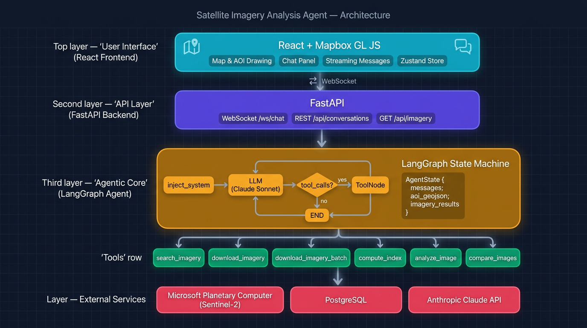

# Satellite Imagery Analysis Agent

An AI-powered geospatial analysis application that autonomously searches, retrieves, and analyzes satellite imagery to answer natural language questions about any area on Earth.
For now, only Sentinel-2 data is available (Copernicus ESA program), but more data sources can be easily setup to increase 
imagery resolution and temporality.

[demo_satellite_imagery.webm](https://github.com/user-attachments/assets/eb3fa206-d83b-417b-a49e-6970f801cb9b)

Draw an area of interest on a map, ask a question in plain English, and the agent plans and executes a multi-step analysis workflow — searching catalogs, downloading spectral bands, computing vegetation or water indices, running visual interpretation with Claude Vision, and streaming every result back in real time.

## Architecture Overview

The system is organized into five layers, each with a clear responsibility:



**Frontend** — A React 18 + TypeScript SPA served by Vite. Mapbox GL JS renders a satellite basemap where users draw AOI polygons via Mapbox Draw. A chat panel displays streaming Markdown responses, tool-status cards, and inline imagery previews. Zustand manages client state; a single WebSocket connection per conversation carries all real-time traffic.

**API Layer** — FastAPI exposes a REST surface for conversation CRUD (`/api/conversations`) and cached imagery serving (`/api/imagery`). The main entry point is a WebSocket endpoint (`/ws/chat/{conversation_id}`) that accepts user messages, persists them in PostgreSQL, launches the agent, and relays streamed events (tokens, tool starts/ends, imagery references) back to the client.

**Agentic Core** — A LangGraph `StateGraph` that implements a ReAct-style loop. On each turn the graph: (1) injects a system prompt with the current AOI bounding box and date context, (2) calls the LLM (Anthropic Claude Sonnet), (3) checks whether the LLM produced tool calls — if yes, routes to a `ToolNode` that executes them and feeds results back to the LLM; if no, the turn ends. The agent state (`AgentState`) carries the message history, the AOI GeoJSON, and accumulated imagery results, persisted across the loop.

**Services** — Two domain services sit behind the tools. `stac.py` wraps `pystac-client` to search and sign Sentinel-2 L2A items from Microsoft Planetary Computer. `raster.py` handles COG downloads (parallel, bbox-clipped via `rasterio`), spectral index computation (NDVI, NDWI, NBR with NumPy), RGB composite generation, and PNG export with `.bounds.json` sidecar files for geo-referenced map overlays.

**External Services** — Microsoft Planetary Computer (Sentinel-2 L2A STAC catalog and COG storage), PostgreSQL 16 (conversations and messages), and the Anthropic API (LLM reasoning + Vision analysis).

## Agentic Workflow

The agent follows a **plan-then-execute** pattern driven entirely by the LLM. There is no hard-coded pipeline — Claude decides which tools to call and in what order based on the user's question and the AOI context. A typical multi-step session looks like:

1. **Search** — `search_imagery` queries the Planetary Computer STAC API with the AOI bbox, a date range (the LLM resolves relative dates like "last month"), and a cloud-cover threshold. Returns a ranked list of scenes.
2. **Download** — `download_imagery` or `download_imagery_batch` fetches specific spectral bands (e.g. B04, B08 for NDVI) as COG tiles, clipped to the AOI. Batch mode parallelizes across scenes for temporal comparisons.
3. **Compute** — `compute_index` derives a spectral index (NDVI, NDWI, or NBR) from downloaded bands, produces a colorized PNG with statistics (min, max, mean).
4. **Analyze** — `analyze_image` sends a PNG to Claude Vision for qualitative interpretation (land-cover description, anomaly detection).
5. **Compare** — `compare_images` computes a pixel-level difference map between two dates, highlighting areas of change.

The LLM may skip steps, reorder them, or loop (e.g., searching again with relaxed cloud cover if the first search returned too few results). Every tool invocation streams status updates to the frontend so the user sees progress in real time.

## Agent Tools

| Tool | Description |
|------|-------------|
| `search_imagery` | Search STAC catalogs by bounding box, date range, cloud cover |
| `download_imagery` | Download specific spectral bands from a single Sentinel-2 scene |
| `download_imagery_batch` | Download the same bands for multiple scenes in parallel |
| `compute_index` | Compute NDVI, NDWI, or NBR and produce colorized PNG + stats |
| `analyze_image` | Visual analysis of imagery using Claude Vision |
| `compare_images` | Multi-date change detection with difference visualization |

## Tech Stack

| Layer | Technologies |
|-------|-------------|
| Frontend | React 18, TypeScript, Vite, Tailwind CSS, Mapbox GL JS, react-map-gl, Zustand |
| Backend | Python, FastAPI, SQLAlchemy (async), asyncpg, Uvicorn |
| Agent | LangGraph, LangChain Anthropic, LangChain Core |
| Geospatial | pystac-client, planetary-computer, rasterio, NumPy, Shapely, Pillow |
| Infra | Docker Compose, PostgreSQL 16, Alembic |

## Prerequisites

- Docker and Docker Compose
- [Anthropic API key](https://console.anthropic.com/)
- [Mapbox access token](https://account.mapbox.com/access-tokens/) (free tier)

## Quick Start

1. **Clone and configure**:
   ```bash
   cp .env.example .env
   # Edit .env and set your ANTHROPIC_API_KEY, MAPBOX_TOKEN, and VITE_MAPBOX_TOKEN
   ```

2. **Start all services**:
   ```bash
   docker-compose up --build
   ```

3. **Open the app**: http://localhost:5173

## Development (without Docker)

### Backend

```bash
cd backend
python -m venv .venv && source .venv/bin/activate
pip install -r requirements.txt
uvicorn app.main:app --reload --port 8000
```

Requires a PostgreSQL instance at the `DATABASE_URL` in `.env`.

### Frontend

```bash
cd frontend
npm install
npm run dev
```

## Usage

1. Draw a polygon or rectangle on the map to define your Area of Interest
2. Ask a question in the chat — for example:
   - *"Find recent cloud-free imagery of this area"*
   - *"Show me the vegetation health (NDVI) for this region"*
   - *"Compare land cover between January and March 2025"*
   - *"What can you see in the latest satellite image of this area?"*
3. The agent autonomously plans and executes the analysis, streaming results back in real time
4. Click **Show on map** on any imagery result to overlay it on the map
